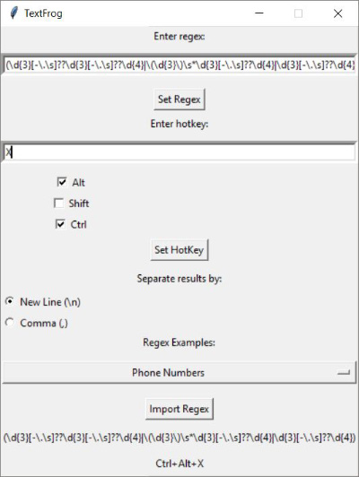
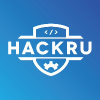

# HackRU 2018  -  TextFrog 

### Summary

A customizable text manipulation automation tool built around the windows clipboard.

This program allows users to assign regular expressions to hotkeys to perform text matches on clipboard data.

### Screenshots

### Credits

Steve Kraft https://github.com/steven-kraft

Noah Eng https://github.com/noaheng

Made at HackRU 2018

